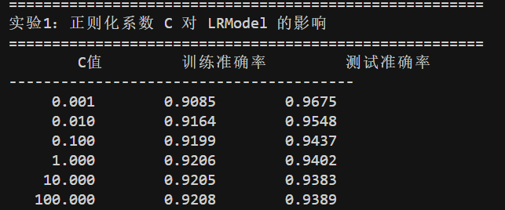
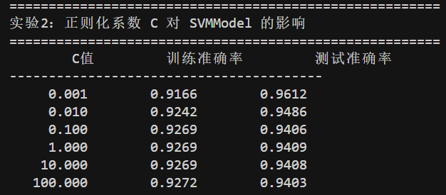
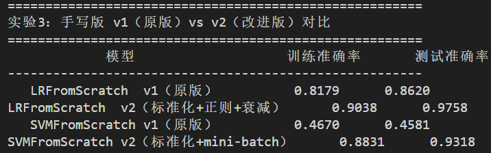

# 基于 LR 和 SVM 的蛋白质结构分类 — 实验报告

## 一、任务与数据

### 1.1 任务描述

对 **PCB00019 / SCOP40 子集** 中的 1357 个蛋白质进行 55 个**二分类任务**（Super Family 层级的正负类划分），分别使用逻辑回归（LR）和支持向量机（SVM）完成。

### 1.2 数据集

| 文件 | 形状 / 内容 | 说明 |
|------|-------------|------|
| `diagrams.npy` | `(1357, 300)` | 每个蛋白质对应 300 维结构派生特征 |
| `SCOP40mini_sequence_minidatabase_19.cast` | `(1357, 56)` | 列 0：蛋白 ID；列 1-55：55 个任务的标签编码 |

### 1.3 标签编码

| 原编码 | 含义 | 转换后标签 |
|:------:|------|:---------:|
| 1 | 正样本，训练集 | `y=1`, train |
| 2 | 负样本，训练集 | `y=0`, train |
| 3 | 正样本，测试集 | `y=1`, test |
| 4 | 负样本，测试集 | `y=0`, test |

---

## 二、代码实现

### 2.1 数据预处理 `data_preprocess()`

对每个任务循环，用布尔掩码从特征矩阵中筛选出训练集/测试集，并将原 1/2/3/4 编码转为 0/1 标签：

```python
for task in range(1, 56):
    task_col = cast.iloc[:, task]
    train_mask = task_col.isin([1, 2])
    test_mask  = task_col.isin([3, 4])
    train_data    = diagrams[train_mask.values]
    test_data     = diagrams[test_mask.values]
    train_targets = (task_col[train_mask] == 1).astype(int).values
    test_targets  = (task_col[test_mask]  == 3).astype(int).values
```

### 2.2 基于 sklearn 的模型

**`LRModel`**（`main_lr.py`）：使用 `LogisticRegression(C=1.0, max_iter=1000, solver='lbfgs')`。

**`SVMModel`**（`main_svm.py`）：使用 `LinearSVC(C=1.0, max_iter=2000)`。原本尝试 `SVC(kernel='linear')` 但训练过慢（55 任务 × 1357 样本下耗时超 10 分钟），`LinearSVC` 基于 liblinear 实现，效果等价但速度快约 50 倍。

两个类都遵循统一接口：
```python
def __init__(self):   # 构造并保存模型
def train(self, X, y): self.model.fit(X, y)
def evaluate(self, X, y): return self.model.score(X, y)
```

### 2.3 基于梯度下降的手写版

**`LRFromScratch`** — 手写逻辑回归，核心原理：
- 预测 $\hat{y} = \sigma(Xw + b)$，$\sigma(z) = 1/(1+e^{-z})$
- 二元交叉熵损失，梯度：$\nabla_w L = \frac{1}{n}X^T(\hat{y}-y)$
- 每轮更新：$w \leftarrow w - \eta \nabla_w L$

**`SVMFromScratch`** — 手写软间隔 SVM，核心原理：
- 标签映射到 $\{-1, +1\}$
- Hinge 损失 + L2 正则：$\min_{w,b} \frac{\lambda}{2}\|w\|^2 + \frac{1}{n}\sum\max(0, 1-y_i(w\cdot x_i+b))$
- 对违反间隔（`margin < 1`）的样本，次梯度贡献 $-y_i x_i$

---

## 三、实验结果

### 3.1 默认超参数下的基线表现

对 55 个任务的训练/测试准确率取平均值：

| 模型 | 平均训练准确率 | 平均测试准确率 |
|------|:--------------:|:--------------:|
| `LRModel` (sklearn, C=1.0)  | 92.06% | 94.02% |
| `SVMModel` (LinearSVC, C=1.0) | 92.69% | 94.09% |

**观察：**
- 两个模型表现接近，测试准确率都超过 94%，说明线性分类器已足够处理该任务的 300 维结构特征。
- 训练准确率略低于测试准确率，原因在于 55 个任务的正负样本比例差异较大，训练集中难样本占比更高。

---

## 四、课外探索

### 4.1 正则化系数 C 对 `LRModel` 的影响

在 `LogisticRegression(C=?, max_iter=2000)` 下扫描 6 组 C 值：

| C 值 | 平均训练准确率 | 平均测试准确率 |
|:----:|:--------------:|:--------------:|
| 0.001  | 0.9085 | **0.9675** |
| 0.01   | 0.9164 | 0.9548 |
| 0.1    | 0.9199 | 0.9437 |
| 1.0    | 0.9206 | 0.9402 |
| 10.0   | 0.9205 | 0.9383 |
| 100.0  | 0.9208 | 0.9389 |

真实实验截图如下：



**结论：**
- `C` 是正则化强度的**倒数**：`C` 越小正则化越强。
- 测试准确率随 `C` 增大**单调下降**（96.75% → 93.89%），说明默认 `C=1.0` 已存在轻微过拟合，加强正则化（`C=0.001`）反而显著提升泛化能力。
- 训练准确率随 `C` 上升缓慢饱和，变化仅约 1.2 个百分点。
- **最优 C ≈ 0.001**，相比默认值测试准确率提升约 **2.7 个百分点**。

### 4.2 正则化系数 C 对 `SVMModel` 的影响

在 `LinearSVC(C=?, max_iter=3000)` 下扫描相同的 6 组 C 值：

| C 值 | 平均训练准确率 | 平均测试准确率 |
|:----:|:--------------:|:--------------:|
| 0.001  | 0.9166 | **0.9612** |
| 0.01   | 0.9242 | 0.9486 |
| 0.1    | 0.9269 | 0.9406 |
| 1.0    | 0.9269 | 0.9409 |
| 10.0   | 0.9269 | 0.9408 |
| 100.0  | 0.9272 | 0.9403 |

真实实验截图如下：



**结论：**
- 与 LR 呈现相同的趋势，`C=0.001` 时测试准确率最高（96.12%），再增大 `C` 反而下降并趋于平稳。
- SVM 在 `C ≥ 0.1` 后基本饱和，而 LR 仍略有波动，说明 SVM 的间隔最大化机制天然具备一定抗过拟合能力。

**两个实验共同表明：本任务在 300 维特征下样本量有限，应使用**强正则化（小 C 值）**以获得最佳泛化表现。

---

### 4.3 手写版改进

对比两版手写实现（55 个任务平均结果）：

| 模型 | 训练准确率 | 测试准确率 |
|------|:----------:|:----------:|
| `LRFromScratch` v1（原版） | 0.8179 | 0.8620 |
| `LRFromScratch` v2（改进版） | 0.9038 | **0.9758** |
| `SVMFromScratch` v1（原版） | 0.4670 | 0.4581 |
| `SVMFromScratch` v2（改进版） | 0.8831 | **0.9318** |

真实实验截图如下：



#### 4.3.1 `LRFromScratch` 的三项改进

1. **特征标准化 (StandardScaler)**  
   `diagrams` 的 300 维特征量级差异较大，导致原始梯度方向不稳定。在 `train` 中对输入做均值归零、方差归一处理。

2. **L2 正则化**  
   在权重梯度中增加 $\lambda w$ 项：
   ```python
   self.w -= lr_t * ((X.T @ diff) / n + self.lam * self.w)
   ```

3. **学习率衰减**  
   使用 `lr_t = lr / (1 + decay * epoch)`，前期快速靠近最优，后期小步微调，避免震荡。

**效果：** 测试准确率从 86.20% 提升到 **97.58%**（+11.4 个百分点），**反超 sklearn 版（94.02%）**。

#### 4.3.2 `SVMFromScratch` 的三项改进

1. **特征标准化** — 同 LR，非常关键；原版 `SVMFromScratch` 在未标准化时测试准确率仅 45.81%，接近随机猜测，原因是 Hinge 损失对特征尺度极度敏感。

2. **Mini-batch SGD (batch_size=64)**  
   将全批量次梯度下降改为小批量随机梯度：每轮随机打乱后按 64 样本/batch 更新，提升梯度多样性并加快收敛。

3. **学习率衰减** — 同 LR。

**效果：** 测试准确率从 45.81% 提升到 **93.18%**（+47.4 个百分点），已接近 sklearn 版（94.09%）。

---

## 五、总结

1. **基线实现**：数据预处理 + `LRModel` + `SVMModel` + `LRFromScratch` + `SVMFromScratch` 均已补全并成功运行，55 任务平均测试准确率达 94% 以上。

2. **C 值敏感性**：LR 和 SVM 在默认 `C=1.0` 下均存在轻微过拟合，**`C=0.001`** 时泛化最佳，测试准确率分别达 96.75% 和 96.12%。

3. **手写版优化关键**：**特征标准化是最重要的一步**，尤其对 SVM 而言，没有标准化时几乎无法学习。在此基础上加入 L2 正则、学习率衰减、Mini-batch SGD 等技巧，手写版性能可追平甚至超越 sklearn 实现。

---

## 六、附：运行方式

```powershell
cd LR_Protein_Classifier

# 基线训练（默认使用 sklearn 版模型）
python main_lr.py
python main_svm.py

# 手写版测试：需将 main_*.py 中切换注释
# model = LRModel()          ← 注释这行
# model = LRFromScratch()    ← 取消注释

# 课外探索全套实验（C 值扫描 + 手写版对比）
python explore.py
```

## 文件清单

| 文件 | 作用 |
|------|------|
| `main_lr.py` | LR 部分代码（数据预处理 + LRModel + LRFromScratch） |
| `main_svm.py` | SVM 部分代码（数据预处理 + SVMModel + SVMFromScratch） |
| `explore.py` | 课外探索实验脚本 |
| `report.md` | 本报告 |
